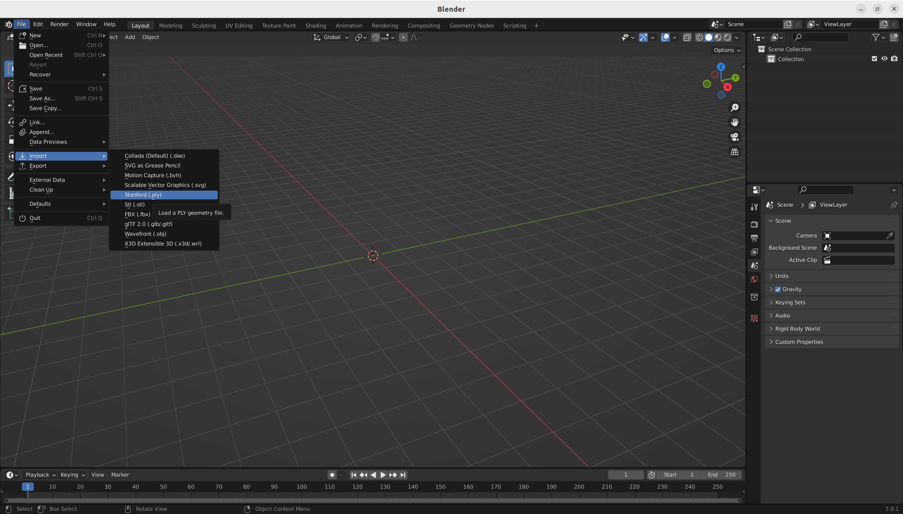
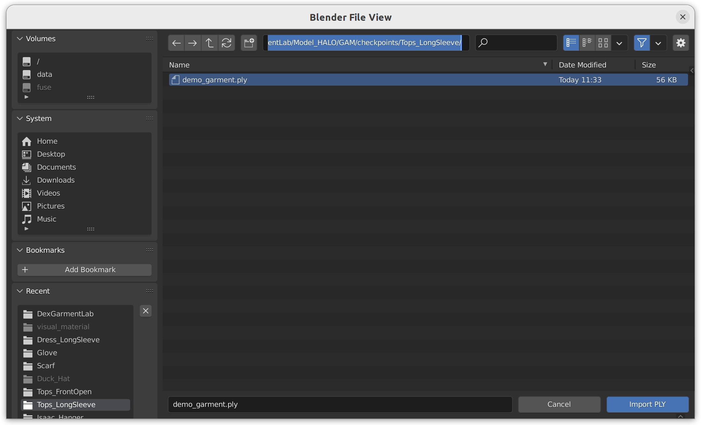
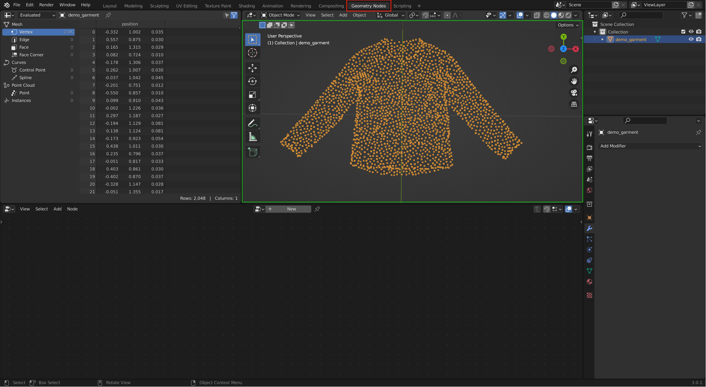
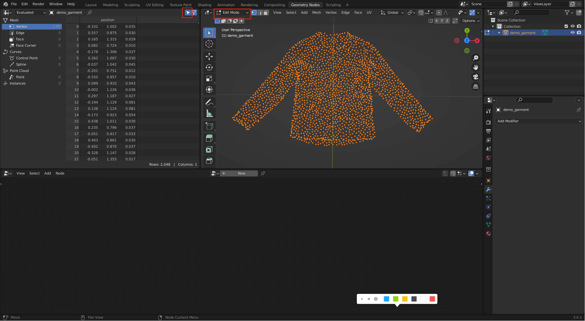
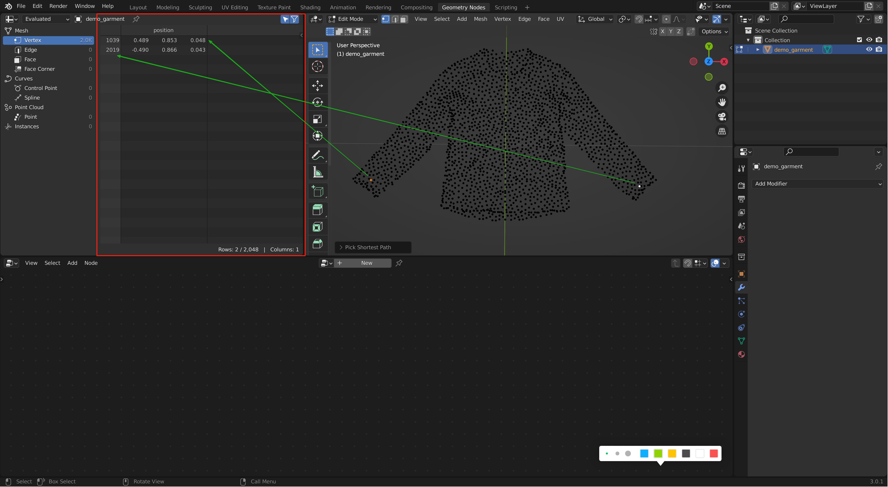

# GAM Usage

As we have already mentioned in paper, GAM's input consists of three parts:
- Demo Garment Point Cloud
- Demo Garment Grasp Points
- Operated Garment Point Cloud

Among these three parts, **the operated garment point cloud** is obtained in simulation environment. While **the demo garment point cloud** is provided in each garment-specific subdirectory within the 'checkpoints/' folder, under the filename **'demo_garment.ply'**.

Here we explain how to get **the demo garment grasp points**.

## Get Demo Garment Grasp Points

Our goal is to obtain the indices of the target points from the demo garment point cloud, which facilitates retrieving the corresponding operation points from the operated garment point cloud via GAM in subsequent steps.

We use **Blender** to achieve this goal. The following is a step-by-step guide:

1. Donwload Blender from [https://www.blender.org/download/](https://www.blender.org/download/).

2. Open Blender and import the demo garment point cloud (demo_garment.ply) into Blender. (Here we use *'Tops_LongSleeve'* as an example)





3. Change to 'Geometry Nodes' mode and adjust the perspective to see the demo garment point cloud clearly.



4. Change to 'Edit Mode' and push 'Show Only Selected' button to hide unselected points.



5. Select the points that you want to operate by clicking on them, and we can get the indices of the selected points. Here we get **1039**, **2019** respectively.



## Python Code of GAM Usage

We have encapsulated the GAM model in 'Model_HALO/GAM/GAM_Encapsulation.py'. The following is the usage of the GAM model.

1. load GAM model
```python
from Model_HALO.GAM.GAM_Encapsulation import GAM_Encapsulation

# please select category according to your demand. 
# Here we use *'Tops_LongSleeve'* as an example.
model = GAM_Encapsulation(catogory="Tops_LongSleeve")   
```

2. get the operated point cloud from simulation environment and use the GAM model to get the corresponding manipulation points.
```python
# get operated point cloud
garment_pcd = XXXX

# use GAM model to get the corresponding manipulation points
manipulation_points, indices, points_similarity = model.get_manipulation_points(input_pcd=garment_pcd, index_list=[1039, 2019])
```

Parameter Description:
- **manipulation_points**: The manipulation points of the operated point cloud corresponding to the demo points of the demo garment point cloud. 
- **indices**: The indices of the manipulation points in the operated point cloud.
- **points_similarity**: The similarity between each point in the operated point cloud and the demo points. 

Assume that The shape of index_list is [N,]. The shape of manipulation_points is [N, 3]. The shape of indices is [N,]. The shape of points_similarity is [N, 2048].