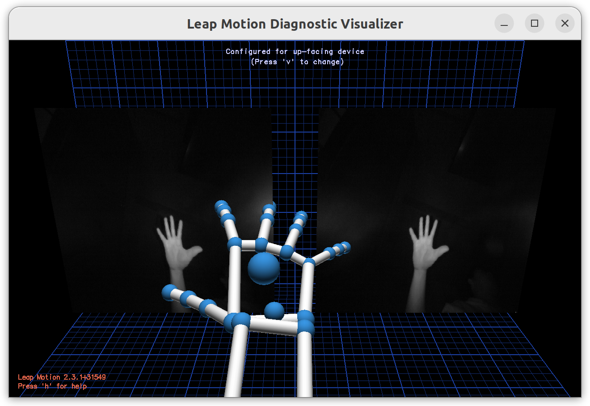

# LeapMotion Guidance

The Doc focuses on the installation and usage of Leapmotion, Just follow the precedure to install and use leapmotion smoothly.

## Installation

prequist:

    Install 'LeapMotion' Assets Filefolder from Google Drive Link as follows:

    >   https://drive.google.com/drive/folders/1tMm_z8O1z3M7jRzhEJQQ3xQsi89XiK3e

Installation precedure:

1. `sudo apt-get install libgl1-mesa-glx`

2. `cd /LeapMotion_Path(changable)/LeapDeveloperKit_2.3.1+31549_linux`

3. `sudo dpkg -i Leap-2.3.1+31549-x64.deb`

4. `sudo vi /lib/systemd/system/leapd.service`

5. Add following content into file above

    >[Unit]
    >
    >Description=LeapMotion Daemon
    >
    >After=syslog.target
    >
    >[Service]
    >
    >Type=simple
    >
    >ExecStart=/usr/sbin/leapd
    >
    >[Install]
    >
    >WantedBy=multi-user.target

6. `sudo ln -s /lib/systemd/system/leapd.service /etc/systemd/system/leapd.service`

7. `sudo systemctl daemon-reload`

8. `sudo service leapd start`

9. `sudo apt-get install swig g++ libpython3-dev`

10. `cd /LeapMotion_Path(changable)/leap-sdk-python3`

11. `sudo make install`

## Usage

When you want to use leapmotion, you need to run following command in terminal:

0. start service

    `sudo service leapd start`

1. connect leapmotion

    `sudo leapd`

2. open Visualization. 

    `Visualizer`

    If the hand is displayed correctly in the visualization interface, then the system is functioning properly. You can close the visualization interface.

  